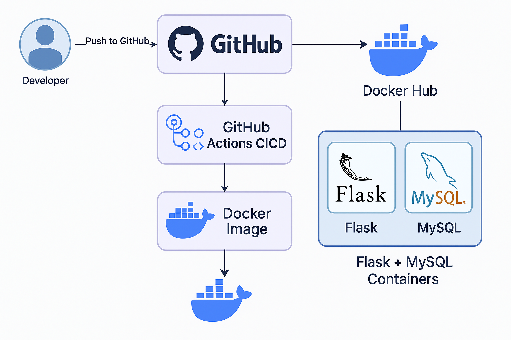
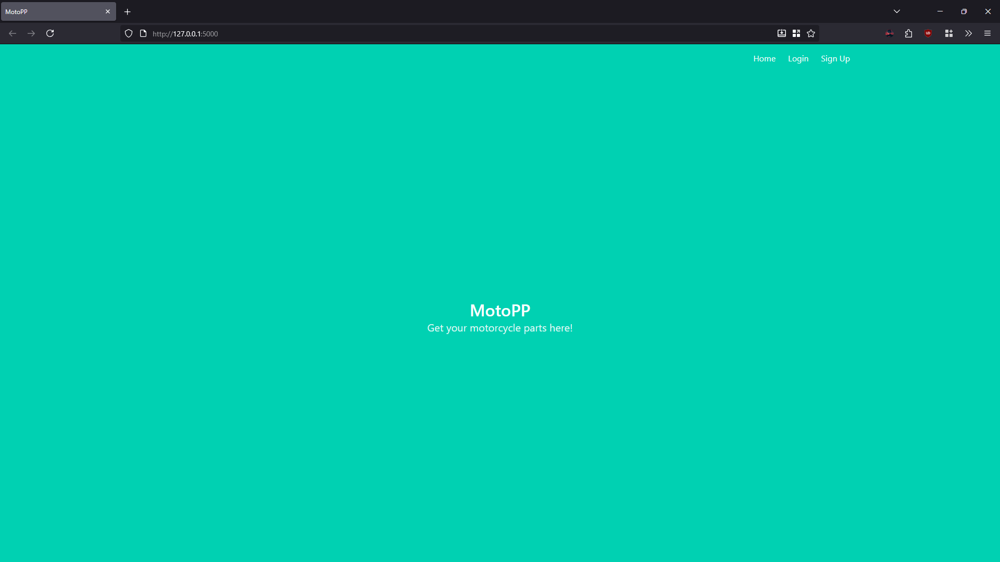
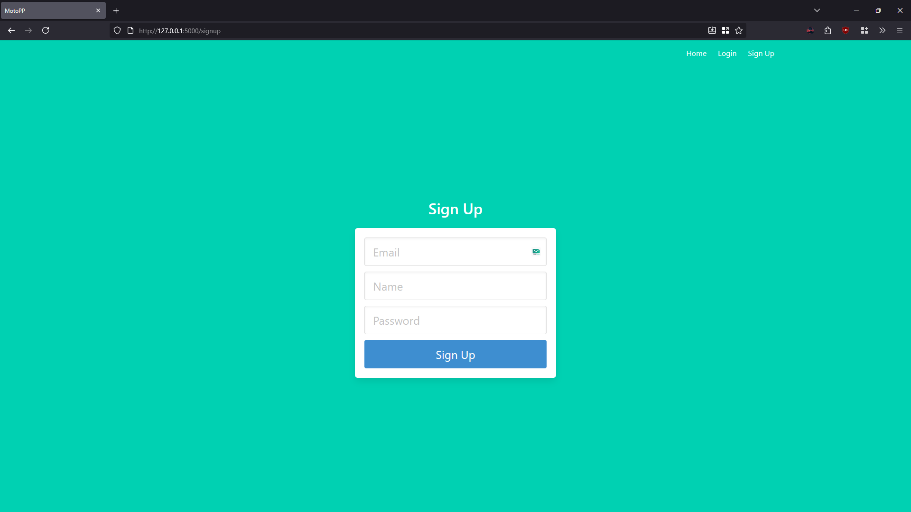
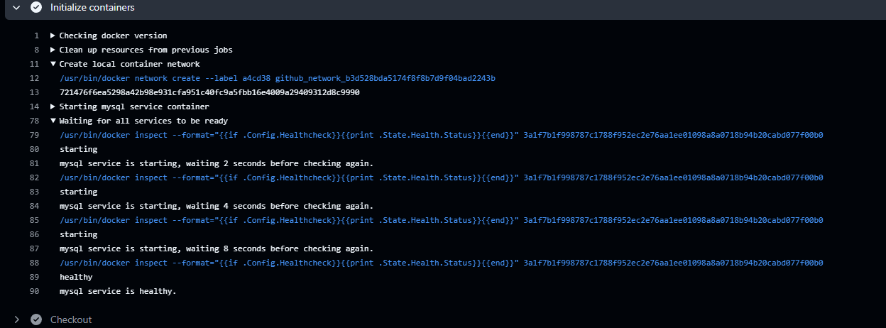
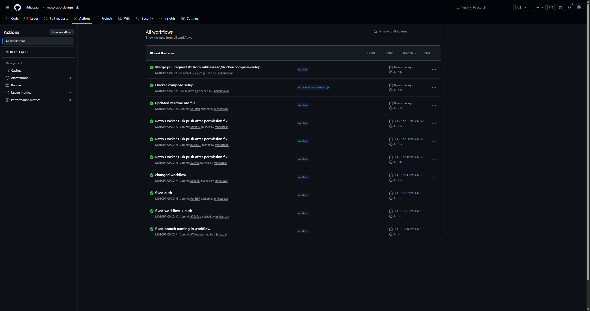
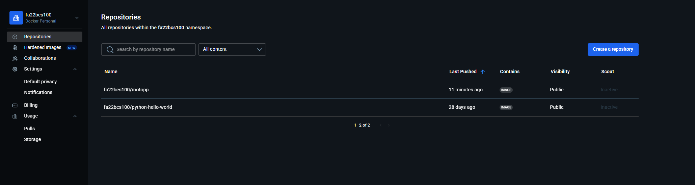

# 🧩 DevOps Project Report — Flask + MySQL Multi-Container CI/CD (MOTOPP)

## 👨‍💻 Student Information
| Field          | Details               |
| -------------- | --------------------- |
| **Name**       | Muhammad Hassan, Baseer Ahmed Tahir, Syed Shabab Akbar       |
| **Roll No**    | FA22-BCS-100, FA22-BCS-104, FA22-BCS-139 |
| **Course**     | DevOps for Cloud Computing   |
| **Instructor** | `Dr. Muhammad Hassan Jamal |
| **Date**       | 28th October, 2025         |

---

## Project Overview
**MOTOPP** is a containerized Flask application with a MySQL backend, built to demonstrate **multi-container orchestration** and **CI/CD automation** using **Docker Compose** and **GitHub Actions**.

The project automates the build, test, and deployment of Docker images to **Docker Hub** whenever changes are pushed to the `master` branch.

---

## Technologies Used
| Component | Technology |
|------------|-------------|
| Web Framework | Flask (Python 3.9) |
| Database | MySQL 8 |
| ORM | SQLAlchemy |
| Containerization | Docker & Docker Compose |
| CI/CD | GitHub Actions |
| Deployment | Docker Hub |

---

## System Architecture
```
Developer → Push to GitHub → GitHub Actions CI/CD → Docker Image → Docker Hub
                           ↓
                    Flask + MySQL Containers
```


Both **Flask** and **MySQL** run in separate containers, orchestrated via `docker-compose`.  
The MySQL container includes a **health check** to ensure it’s ready before Flask starts.

---

## Docker Configuration

### **Dockerfile**
```dockerfile
FROM python:3.9-slim

WORKDIR /app

COPY ./requirements.txt .
RUN pip install --no-cache-dir -r requirements.txt

COPY . /app/motopp


RUN if [ -f /app/motopp/run.sh ]; then sed -i 's/\r$//' /app/motopp/run.sh && chmod +x /app/motopp/run.sh; fi

ENV FLASK_APP=motopp
ENV FLASK_RUN_HOST=0.0.0.0
ENV FLASK_RUN_PORT=5000
ENV ENV=prod
ENV PYTHONUNBUFFERED=1

EXPOSE 5000

CMD [ "sh", "-c", "[ -x /app/motopp/run.sh ] && /app/motopp/run.sh || flask run" ]

```

### **docker-compose.yaml**
```yaml
version: '3.9'

services:
  mysql:
    image: mysql:8.0
    restart: always
    environment:
      MYSQL_ALLOW_EMPTY_PASSWORD: "yes"
      MYSQL_DATABASE: motopp
    volumes:
      - mysql_data:/var/lib/mysql
    healthcheck:
      test: ["CMD", "mysqladmin", "ping", "-h", "127.0.0.1", "-uroot"]
      interval: 10s
      timeout: 5s
      retries: 10

  motopp:
    build: ./motopp
    depends_on:
      mysql:
        condition: service_healthy
    environment:
      SECRET_KEY: ${SECRET_KEY}
      MYSQL_HOST: mysql
      MYSQL_USER: root
      MYSQL_DATABASE: motopp
      FLASK_ENV: production
    ports:
      - "5000:5000"
    command: ["sh", "-c", "sleep 10 && /app/motopp/run.sh -d 0"]

volumes:
  mysql_data: {}

```

---

## CI/CD Workflow (GitHub Actions)

### **Workflow Trigger**
```yaml
on:
  push:
    branches: [ master ]
```

### **Pipeline Stages**
| Stage | Description |
|--------|--------------|
| **Install & Build** | Installs dependencies from `requirements.txt` |
| **Lint & Security** | Runs `flake8` and `bandit` |
| **DB Health Check** | MySQL container verified with `mysqladmin ping` |
| **Testing** | Runs `pytest` |
| **Build Image** | Builds Docker image for Flask app |
| **Push Image** | Tags and pushes image to Docker Hub (`motopp:latest`) |

---

##  Database Health Check in CI
In the CI pipeline, MySQL runs as a service and is verified with:
```bash
mysqladmin ping -h 127.0.0.1 -uroot
```
The build only continues once the database returns a “healthy” status, ensuring Flask and tests run reliably.

---

## GitHub Secrets
| Secret | Description |
|--------|--------------|
| `DOCKER_USERNAME` | Docker Hub username |
| `DOCKER_PASSWORD` | Docker Hub access token (Read/Write permissions) |

- Secrets like DOCKER_USERNAME and DOCKER_PASSWORD are stored in the GitHub repository’s Settings → Secrets and Variables → Actions section.
- These secrets are automatically injected into the CI/CD workflow at runtime and are never exposed in logs or code.
---

## Screenshots

| # | Description | Screenshot |
|---|--------------|-------------|
| 1️⃣ | **Docker Compose containers running** |  |
| 2️⃣ | **App running on localhost:5000** |  |
| 3️⃣ | **Signup/Login Success Page** |  |
| 4️⃣ | **MySQL Health Check — running (healthy)** |  |
| 5️⃣ | **GitHub Actions Workflow — Successful Run** |  |
| 6️⃣ | **Docker Hub Repository — motopp:latest** |  |

---


## Testing Process
The testing process in this project is integrated into the **CI/CD workflow** using **GitHub Actions** to automatically validate the application and environment before deployment.  

### CI/CD Testing Stages

1. **Linting Tests (flake8):**  
   - Ensures Python code follows correct syntax.  
   - Detects early-stage errors before the build process begins.

2. **Security Scanning (bandit):**  
   - Analyzes the Flask application for security vulnerabilities such as unsafe imports, weak cryptographic functions, and potential injection risks.  
   - Helps maintain secure code practices within the CI pipeline.

3. **Automated Test Execution (pytest):**  
   - Runs unit tests if any are available inside the repository.  
   - Uses a fail-safe mechanism (`pytest || echo "No tests / optional tests skipped."`) to prevent pipeline failure when no tests are defined.  
   - Ensures the testing stage remains CI-friendly and future-proof for test automation.

4. **Database Health Check:**  
   - Uses `mysqladmin ping` to verify that the MySQL service is active and ready before executing any app logic or test cases.  
   - Prevents false test failures due to uninitialized database connections.

---


## Lessons Learned
1. **Containerization**
-- Learned how to use Docker and Docker Compose to build and manage multiple interdependent containers (Flask + MySQL).
2. **Health Check Implementation**
-- Understood the importance of health checks to ensure dependent services (MySQL) are ready before application startup.
3. **CI/CD Automation**
-- Gained hands-on experience with GitHub Actions — automating build, linting, testing, and deployment stages.

4. **Secret Management**
-- Learned how to manage sensitive credentials securely using GitHub Secrets in workflows instead of hardcoding them.

5. **Error Handling and Debugging**
-- Encountered and resolved common container and CI issues such as failed imports, database connection errors, and authentication failures.

6. **End-to-End Integration**
-- Successfully integrated version control, containerization, CI/CD, and deployment into one automated workflow.

---


## Conclusion
This project demonstrates
- Containerization with **Docker**
- Service orchestration via **Docker Compose**
- Automated CI/CD through **GitHub Actions**
- Secure image deployment to **Docker Hub**

It fulfills the lab exam requirements, including **multi-container setup, DB health check, CI pipeline, and image push automation.**

