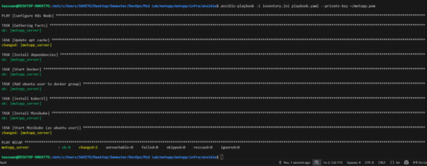
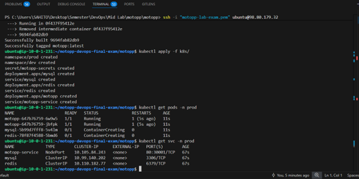
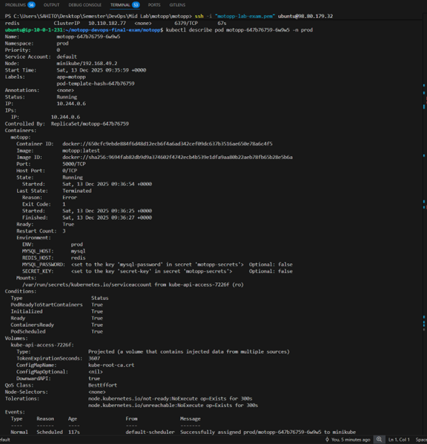
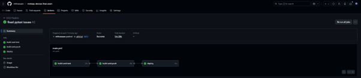
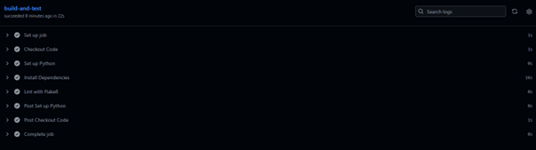
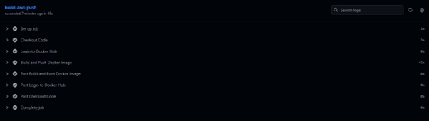
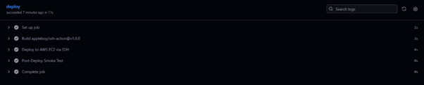

# 🧩 Final Report — Lab Final Exam (Fall 2025)
## 👨‍💻 Student Information
| Field          | Details               |
| -------------- | --------------------- |
| **Name**       | Muhammad Hassan, Baseer Ahmed Tahir, Syed Shabab Akbar       |
| **Roll No.**    | FA22-BCS-100, FA22-BCS-104, FA22-BCS-139 |
| **Course**     | DevOps for Cloud Computing   |
| **Instructor** | Dr. Muhammad Hassan Jamal |
| **Lab Instructor** | Muhammad Adeel Qayyum |
| **Date**       | 16th December, 2025         |
---

## 1. Technologies Used
The following stack was implemented to achieve a cloud-native, automated DevOps lifecycle:

| Component | Technology | Description |
| :--- | :--- | :--- |
| **Application** | Flask (Python) | Web backend serving the *MOTOPP* application. |
| **Database** | MySQL 8.0 | Persistent relational database for storing bike data. |
| **Cache** | Redis (Alpine) | In-memory key-value store for caching and message queuing. |
| **Infrastructure** | Terraform (AWS) | IaC to provision VPC, Security Groups, and EC2 instances. |
| **Configuration** | Ansible | Automated configuration of Docker, Minikube, and kubectl on EC2. |
| **Orchestration** | Kubernetes (Minikube) | Container orchestration using Deployments, Services, and Secrets. |
| **CI/CD** | GitHub Actions | Automated pipeline for testing, building, pushing, and deploying. |
| **Monitoring** | Prometheus & Grafana | Real-time metrics collection and visualization. |

---

## 2. Pipeline & Infrastructure Diagram

### System Architecture
The architecture consists of a **GitHub Actions** pipeline that builds the Docker image and pushes it to **Docker Hub**. The pipeline then connects via SSH to an **AWS EC2 instance**, where **Minikube** orchestrates the application containers.


### Infrastructure Provisioning (Terraform)
Terraform was used to provision a custom **VPC** and an **EC2 instance** acting as the Kubernetes node.

- **Screenshot:** Terraform Apply Output  
  

- **Screenshot:** AWS Resources (EC2 & S3)  
  
  
---

## 3. Deployment & Configuration

### Ansible Configuration
Ansible was used to automate the installation of **Docker**, **Minikube**, and **kubectl** on the raw EC2 instance.

- **Screenshot:** Ansible Playbook Success  
  

### Kubernetes Deployment
The application was deployed into the `prod` namespace with separate services for **MySQL** and **Redis**.

- **Screenshot:** Pods and Services (`kubectl get pods`, `kubectl get svc`)  
  

- **Screenshot:** Pod Description (`kubectl describe pod`)  
  

---

## 4. CI/CD Pipeline Strategy
The CI/CD pipeline is defined in `.github/workflows/main.yml` and consists of three main stages:

1. **Build & Test**  
   - Installs Python dependencies
   - Runs `flake8` for linting

2. **Build & Push**  
   - Authenticates with Docker Hub using GitHub Secrets
   - Builds and pushes the tagged Docker image

3. **Deploy**  
   - Connects to the AWS EC2 instance via SSH
   - Triggers a `kubectl rollout restart` to update the running application

- **Screenshot:** GitHub Actions Successful Pipeline  
  
  
  
  


---

## 5. Secret Management Strategy
To prevent hardcoding sensitive data (which results in mark deductions), a multi-layer secret management strategy was implemented:

- **Local Development**  
  - `.env` file (ignored via `.gitignore`) for `MYSQL_PASSWORD`, `SECRET_KEY` & `MYSQL_ROOT_PASSWORD`

- **Infrastructure (Terraform)**  
  - AWS credentials injected via environment variables or AWS CLI profiles
  - No secrets stored directly in `.tf` files

- **CI/CD Pipeline**  
  - GitHub Repository Secrets such as `DOCKER_PASSWORD` and `SSH_KEY`

- **Production (Kubernetes)**  
  - Kubernetes Secrets (`k8s/02-secrets.yaml`) mounted into pods at runtime

---

## 6. Monitoring Strategy
Prometheus and Grafana were deployed (via Helm) to monitor cluster health and performance.

- **Prometheus** scrapes metrics from Kubernetes nodes and pods
- **Grafana** visualizes metrics such as CPU usage, memory usage, and pod health

**Access Method:**
Secure access was achieved using SSH tunneling:

```bash
ssh -i motopp-lab-exam.pem -L 3000:localhost:30707 ubuntu@<EC2_PUBLIC_IP>
```

- **Screenshot:** Grafana Dashboard (CPU & Memory Usage)  
  

---

## 7. Lessons Learned
Throughout the implementation, several real-world DevOps challenges were encountered and resolved:

### Resource Constraints (t3.medium)
- **Issue:** EC2 instance ran out of disk space when pulling large monitoring images
- **Solution:** Disabled heavy components (AlertManager, NodeExporter) and cleaned Minikube caches

### Networking & Firewalls
- **Issue:** Grafana access via NodePort failed due to AWS Security Group restrictions
- **Solution:** Implemented SSH tunneling to securely forward internal ports to localhost

### Docker Build Context
- **Issue:** Docker build failed because files could not be located during `COPY`
- **Solution:** Adjusted the build context to the `motopp/` directory

---

## 8. Final Cleanup
After successful evaluation, all cloud resources were destroyed to avoid unnecessary billing.

- **Screenshot:** Terraform Destroy  
  
  

---

